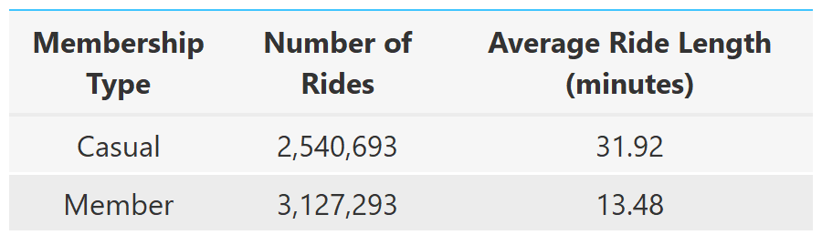

<!-- README.md is generated from README.Rmd. Please edit that file -->

**WORK IN PROGRESS**

This is the capstone project for the [Google Data Analytics
Certificate](https://www.coursera.org/professional-certificates/google-data-analytics?)
available through [Coursera](https://www.coursera.org/)

For my capstone, I chose to complete Track 1 with the *Cyclistic* bike-share
case study. 

Background information about the case study can be found in the `info` folder. 

**Note About Code**: I tried to included the package name the first time I use a
function. Like this `rio::import`.

# **Question to Answer**

How do annual members and casual riders use Cyclistic bikes differently?

You will produce a report with the following deliverables:

1. A clear statement of the business task
2. A description of all data sources used
3. Documentation of any cleaning or manipulation of data
4. A summary of your analysis
5. Supporting visualizations and key findings
6. Your top three recommendations based on your analysis


# **Business Task**

The business task is to compare casual and member riders to help develop a 
strategy to convert casual riders to member riders. 

# **Data Source:** 
This data is made available by [Divvy Bikes](https://ride.divvybikes.com/data-license-agreement) for use, the name of the company has just been changed. Data is available [here](https://divvy-tripdata.s3.amazonaws.com/index.html).

```{r setup, include = FALSE, echo = TRUE}
knitr::opts_chunk$set(
  collapse = TRUE,
  comment = "#>",
  fig.path = "README-",
  echo = FALSE,
  message = FALSE,
  warning = FALSE
)

pacman::p_load(tidyverse, rio, here, janitor, gt, gtExtras)

conflicted::conflict_prefer("select", "dplyr")
conflicted::conflict_prefer("filter", "dplyr")
```

```{r data-import-raw, eval = FALSE, echo = TRUE}

# import 1 file to see structure
march_2021 <- rio::import(here::here("bike_data", "202103-divvy-tripdata.csv"), 
                          setclass = "tibble")

# create list of all file names
bike_files <- list.files(here("bike_data"), pattern = ".csv", full.names = TRUE)

# import all files and combine into one tibble
bikes_raw <- bike_files %>% 
  lapply(import, setclass = "tibble") %>% 
  dplyr::bind_rows()

rio::export(bikes, file = hehere("bike_data", "all_bikes.rds"))

```

```{r data-import-merged, include = FALSE}
bikes_raw <- import(here("bike_data", "all_bikes.rds"))
```

# Data Wrangling

```{r data-wrangling, include = TRUE, echo = TRUE}
bikes <- bikes_raw %>% 
  dplyr::mutate(ride_length = as.numeric(difftime(ended_at, started_at, units = "mins")),
                day = lubridate::wday(started_at, label = TRUE)) %>% 
  mutate(member_casual = case_when(member_casual == "casual" ~ "Casual", 
                                   TRUE ~ "Member"))

bikes_sum <- bikes %>% 
  dplyr::group_by(member_casual) %>% 
  dplyr::summarize(number = n(), across(ride_length, mean))

bike_sum2 <- bikes %>% 
  group_by(day, member_casual) %>% 
  summarize(number = n(), across(ride_length, mean))

```

# Comparing Casual and Member Riders

```{r comparison, eval = FALSE, echo = TRUE}
(sum_gt <- bikes_sum %>% 
  gt::gt() %>% 
  gt::cols_label(member_casual = md("Membership Type<br> "),
                 number = md("Number of Rides<br> "),
                 ride_length = md("Average Ride Length<br>(minutes)")) %>% 
  gt::cols_width(everything() ~ px(120)) %>% 
  cols_width(3 ~ px(200)) %>% 
  gt::cols_align(everything(), align = "center") %>% 
  gt::fmt_number(columns = 2, decimals = 0) %>% 
  gt::fmt_number(columns = 3, decimals = 2) %>% 
  gtExtras::gt_theme_guardian()
)

gt::gtsave(sum_gt, here("outputs", "membership_comparison.png"))

```

<p align="center"></p>

While there were more rides by Members in the past year, the average ride length
for Casual riders was **2.4 times longer** than that of Member riders.


```{r plotting, include = FALSE}
bike_sum2 %>% 
  ggplot(aes(day, number, fill = member_casual)) + 
  geom_line(aes(group = member_casual), alpha = 0.25, size = 0.5) + 
  geom_point(aes(size = ride_length), shape = 21, color = "black") +
  scale_y_continuous(labels = scales::comma_format()) +
  labs(x = NULL, y = NULL, 
       title = "Number of Riders Per Day of the Week",
       subtitle = "Larger Circles Indicate Longer Rides")
  theme_bw()
```