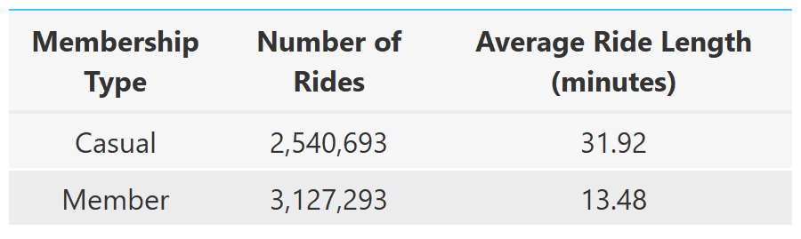
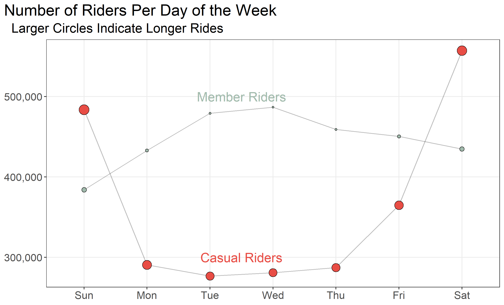

GDAC Capstone
================

<!-- README.md is generated from README.Rmd. Please edit that file -->

This is the capstone project for the [Google Data Analytics
Certificate](https://www.coursera.org/professional-certificates/google-data-analytics?)
available through [Coursera](https://www.coursera.org/)

For my capstone, I chose to complete Track 1 with the *Cyclistic*
bike-share case study.

Background information about the case study can be found in the `info`
folder.

**Note About Code**: I tried to included the package name the first time
I use a function. Like this `rio::import`.

# **Question to Answer**

How do annual Member and Casual Riders use Cyclistic bikes differently?

You will produce a report with the following deliverables:

1.  A clear statement of the business task
2.  A description of all data sources used
3.  Documentation of any cleaning or manipulation of data
4.  A summary of your analysis
5.  Supporting visualizations and key findings
6.  Your top three recommendations based on your analysis

# **Business Task**

The business task is to compare Casual and Member Riders to help develop
a strategy to convert Casual Riders to Member Riders.

# **Data Source:**

This data is made available by [Divvy
Bikes](https://ride.divvybikes.com/data-license-agreement) for use, the
name of the company has just been changed. Data is available
[here](https://divvy-tripdata.s3.amazonaws.com/index.html).

``` r
# import 1 file to see structure
march_2021 <- rio::import(here::here("bike_data", "202103-divvy-tripdata.csv"), 
                          setclass = "tibble")

# create list of all file names
bike_files <- list.files(here("bike_data"), pattern = ".csv", full.names = TRUE)

# import all files and combine into one tibble
bikes_raw <- bike_files %>% 
  lapply(import, setclass = "tibble") %>% 
  dplyr::bind_rows()

rio::export(bikes, file = here("bike_data", "all_bikes.rds"))
```

# Data Wrangling

``` r
bikes <- bikes_raw %>% 
  dplyr::mutate(ride_length = as.numeric(difftime(ended_at, started_at, units = "mins")),
                day = lubridate::wday(started_at, label = TRUE)) %>% 
  mutate(member_casual = case_when(member_casual == "casual" ~ "Casual", 
                                   TRUE ~ "Member"))

bikes_sum <- bikes %>% 
  dplyr::group_by(member_casual) %>% 
  dplyr::summarize(number = n(), across(ride_length, mean))

bike_sum2 <- bikes %>% 
  group_by(day, member_casual) %>% 
  summarize(number = n(), across(ride_length, mean))
```

# Comparing Casual and Member Riders

``` r
(sum_gt <- bikes_sum %>% 
  gt::gt() %>% 
  gt::cols_label(member_casual = md("Membership Type<br> "),
                 number = md("Number of Rides<br> "),
                 ride_length = md("Average Ride Length<br>(minutes)")) %>% 
  gt::cols_width(everything() ~ px(120)) %>% 
  cols_width(3 ~ px(200)) %>% 
  gt::cols_align(everything(), align = "center") %>% 
  gt::fmt_number(columns = 2, decimals = 0) %>% 
  gt::fmt_number(columns = 3, decimals = 2) %>% 
  gtExtras::gt_theme_guardian()
)

gt::gtsave(sum_gt, here("outputs", "membership_comparison.png"))
```

<p align="center">

</p>

While there were more rides by Members in the past year, the average
ride length for Casual Riders was **2.4 times longer** than that of
Member Riders.

``` r
(sum_gg <- bike_sum2 %>% 
  ggplot(aes(day, number, fill = member_casual)) + 
  geom_line(aes(group = member_casual), 
            alpha = 0.25, size = 0.5, show.legend = FALSE) + 
  geom_point(aes(size = ride_length), shape = 21, 
             color = "black", show.legend = FALSE) +
  scale_y_continuous(labels = scales::comma_format()) +
  scale_fill_manual(values = c("#E84D45", "#A1BAAC")) + 
  annotate(geom = "text", color = "#A1BAAC", 
           x = 3.5, y = 500000, size = 6,
           label = "Member Riders") + 
  annotate(geom = "text", color = "#E84D45",
           x = 3.5, y = 300000, size = 6,
           label = "Casual Riders") + 
  labs(x = NULL, y = NULL, 
       title = "Number of Riders Per Day of the Week",
       subtitle = "  Larger Circles Indicate Longer Rides") + 
  theme_bw() +
  theme(plot.title.position = "plot", 
        text = element_text(size = 17),
        panel.grid.minor = element_blank())
)

ggsave(sum_gg, filename = here("outputs", "comparison_plot.png"))
```

<p align="center">

</p>

Member Riders primarily rode during the week, and had shorter rides. In
contrast, Casual Riders primarily rode on the weekends, and the rides
were longer.

# Recommendations

Based on this analysis, I recommend the following possible
implementations:

1.  A shorter time for Casual Riders before they have to pay an
    additional fee. This could incentivize frequent Casual Riders to
    upgrade to Member Riders.

2.  A promotion for Casual Riders to have cheaper rates on the weekend.

3.  A different pricing strategy that incentivizes Casual Riders to
    convert to Member Riders if they do ride during the week.
